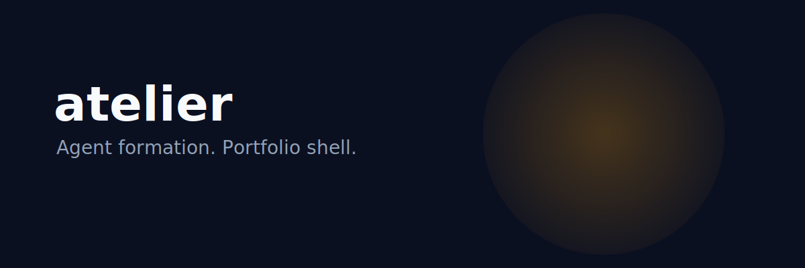

# atelier

<p align="center">
  
</p>

<p align="center">
  
</p>

<h3 align="center">Agent formation. Portfolio shell.</h3>

<p align="center">DropClass v1 shell — mount agent routes, supervise enrollments, publish portfolio pages.</p>

<p align="center">
  <a href="https://lumenhelixlab.github.io/atelier/">Launch Page</a>
  <span> · </span>
  <a href="https://github.com/lumenhelixlab/atelier">GitHub</a>
  <span> · </span>
  <a href="https://lumenhelix.com">LumenHelix</a>
</p>

---

atelier is the LumenHelix portfolio shell for agent formation. v1 powers DropClass — Coursera student agents and Class Central discovery — with a React + Vite UI and a FastAPI host that mounts agent routes locally.

## Why atelier

- **Ship faster.** Reusable templates cut setup time to minutes.
- **Stay traceable.** Reversible decisions mean you can always see why something changed.
- **Own your stack.** Local-first, no mandatory cloud, no lock-in.

## Quick start

### macOS / Linux

```bash
git clone https://github.com/lumenhelixlab/atelier.git
cd atelier
cd api && python3 -m venv ../.venv && ../.venv/bin/pip install -r requirements.txt
cd ../app && npm install && npm run dev
```

### Windows (PowerShell)

```powershell
git clone https://github.com/lumenhelixlab/atelier.git
Set-Location atelier
cd api
python -m venv ..\.venv
..\.venv\Scripts\pip install -r requirements.txt
cd ..\app
npm install
npm run dev
```

### Windows (Git Bash / WSL)

```bash
git clone https://github.com/lumenhelixlab/atelier.git
cd atelier
cd api && python3 -m venv ../.venv && ../.venv/bin/pip install -r requirements.txt
cd ../app && npm install && npm run dev
```

> Tested on Windows 11, macOS Sonoma, Ubuntu 22.04/24.04, and modern mobile browsers.

## Features

| Feature | What it gives you |
|---------|-------------------|
| Agent scaffolding | Drop-in patterns for memory, tools, skills, and workflows. |
| Portfolio publishing | Generate a public project page from your repo metadata. |
| Reversible by design | Every change is traceable so you can roll back without guesswork. |
| Local-first stack | React + Vite frontend, FastAPI backend, zero required cloud. |

## Architecture

```
atelier/
├── api/      FastAPI host — mounts DropClass routes
├── app/      React (Vite) UI — /formation, supervisor dashboard
└── scripts/  PowerShell starters
```

## Development

```bash
# API on port 8100
cd api && python -m uvicorn main:app --host 127.0.0.1 --port 8100
# UI on port 5180 (new terminal)
cd app && npm run dev
```

## Roadmap

- [ ] Plugin API for HOOT and other portfolio modules
- [ ] Obsidian vault sync for agent memory
- [ ] One-command production build pipeline

## License

Released under the MIT License.

---

<p align="center">
  <sub>atelier is a <a href="https://lumenhelix.com">LumenHelix</a> project — Applied Symbolic Dynamics & Reversible Computation.</sub>
</p>
